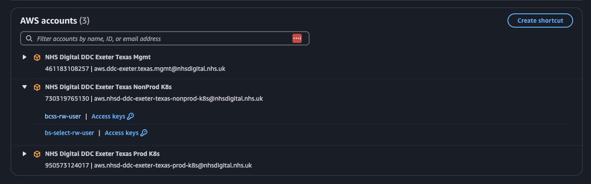
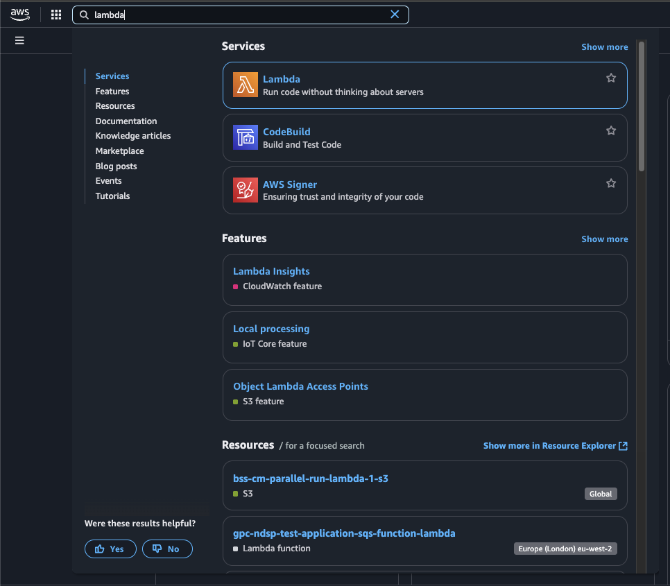
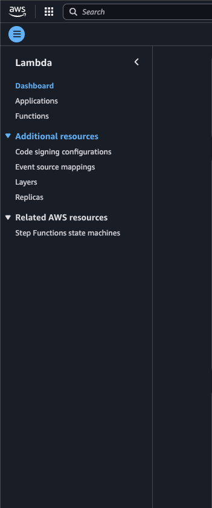

# Bowel Cancer Screening System notifications

This repository contains a collection of serverless functions used to notify batches of recipients from the Bowel Cancer Screening System.

The functions are intended to be deployed to AWS Lambda.

## Functions

The names of the functions are a work in progress. They are described below:


### Batch Notification Processor

This function calls the BCSS Oracle database to obtain a batch of recipients eligible for pre-invitation notifications.
The function schedules a second function which performs a status check on notifications sent for the batch.


### Message Status Handler

This function checks the status of notification from the batch and is scheduled by the function.
This function is only scheduled if the batch processor function has successfully sent a batch to Communication Management API via the message batch endpoin.
It updates the status of a batch of pre-invitations in the BCSS Oracle database.
Currently the only status we update in Oracle is if the message has been read on the `nhsapp` channel within the last 24 hours.

## Accessing AWS Lambda Functions via the AWS Console

To access AWS Lambda functions, follow the steps below:

1. Go to the following link:  
   [AWS Start Portal](https://d-9c67018f89.awsapps.com/start/#/?tab=accounts)  
   This will take you to the AWS Start Portal, where you can view the AWS accounts you have been granted access to.

2. Look for the following AWS accounts in the list:
   - **NHS Digital DDC Exeter Texas Mgmt**
   - **NHS Digital DDC Exeter Texas NonProd K8s**
   - **NHS Digital DDC Exeter Texas Prod K8s**


   *If you do not see these accounts listed, please contact the Texas Platform team for access.*

   

3. When working in development, you should use the **NHS Digital DDC Exeter Texas NonProd K8s** account and log in as the **bcss-rw-user**.

4. Once your AWS Console has loaded, use the search bar in the upper-left corner and search for **Lambda**.

   

5. On the main Lambda service page, select **Functions** from the sidebar.

   

6. You should now see a page listing all available Lambda functions.  
   **Be careful not to modify any functions unless you are certain they are managed by this team,** as some functions are managed by other teams.

7. Use the search bar on this page to find the specific Lambda function you are working on.  
   Currently, our Lambda functions are named:

   - bcss-s3-to-lambda-trigger
   - bcss_notify_callback
   - bcss-lambda-s3-oracle

## Development setup

### Prerequisites

- Python >= 3.11
- Docker (for local Oracle database)
- Docker compose plugin (for local Oracle database)

### Setup

Dependencies are managed using pipenv. To install the dependencies and activate the virtual environment, run:

```bash
pip install pipenv
pipenv install --dev
pipenv shell
```

### Environment variables

We use .env files to manage environment variables. To create a new .env file, copy the example file:

```bash
cp .env.example .env.local
```

### Oracle database container

We use a containerised Oracle database for local development and integration tests.
The development/test database connection details can be found in the .env.example file.
To start the Oracle database container, run:

```bash
./start-dev-db.sh
```


## Linting

We use pylint for linting, this can be run using the script:

```bash
./lint.sh
```

## Running the tests

We use pytest for tests, these can be run using the script:

```bash
./test-unit.sh
```
